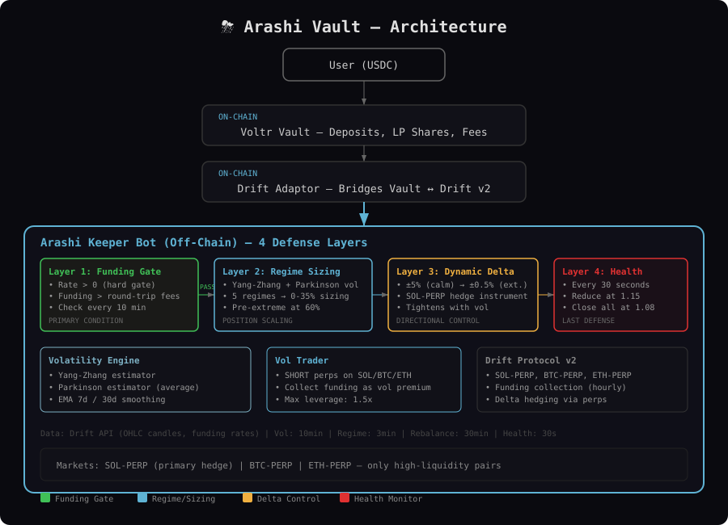

# ⛈️ Arashi Vault

**Bidirectional Funding Harvester with Optimized Yield on Solana.**

Arashi rides the storm — in both directions. A production-grade USDC vault that harvests Drift perpetual funding rates by always positioning on the receiving side: SHORT when longs pay shorts, LONG when shorts pay longs. During extreme volatility, idle capital earns optimized lending yield routed to the highest-rate protocol. Three revenue sources active in every market condition — capital is never idle.

## Strategy

Arashi combines bidirectional funding harvesting with yield optimization:

1. **Bidirectional funding (primary)** — Always on the receiving side of funding flow
2. **Optimized lending (idle periods)** — Route to best protocol (Kamino ~6.5%, not Drift Earn ~1.5%)
3. **LST collateral yield** — jitoSOL as collateral earns ~7% staking + MEV on active positions

### How It Works

```
User deposits USDC → Voltr Vault
                      └── Arashi Keeper
                           ├── Emergency Monitor (30s)
                           │   ├── Health ratio (close at 1.08)
                           │   └── Drawdown (5% reduce / 8% close)
                           ├── Vol Engine (5 min)
                           │   ├── Yang-Zhang + Parkinson estimators
                           │   └── EMA smoothing (7d / 30d)
                           ├── Funding Direction (10 min)
                           │   ├── Positive → SHORT to collect
                           │   ├── Negative → LONG to collect
                           │   └── |Rate| must exceed cost threshold
                           ├── Yield Optimizer
                           │   ├── Best lending rate (Kamino/Marginfi/Drift)
                           │   ├── LST collateral (jitoSOL)
                           │   └── Transparent APY breakdown
                           ├── Regime Detector (2 min)
                           │   ├── 5 regimes → 0-40% sizing
                           │   ├── Pre-extreme wind-down at 65%
                           │   └── Emergency sigma push (2.5σ)
                           ├── Position Manager (2hr rebalance)
                           │   ├── Open in correct funding direction
                           │   ├── Flip direction on sign change
                           │   └── Maker limit orders (postOnly)
                           └── Delta Hedger (regime-aware)
                               └── ±5% calm → ±0.5% extreme
```

### Yield Stack

| Source | Condition | Mechanism | Est. APY |
|--------|-----------|-----------|----------|
| Funding (SHORT) | Bull market, positive funding | Collect from longs | 4-8% |
| Funding (LONG) | Bear market, negative funding | Collect from shorts | 4-8% |
| Lending (idle) | Extreme vol regime | Best protocol routing | 1-2% |
| LST collateral | Active positions | jitoSOL staking + MEV | 1-2% |
| Maker rebates | All trades | postOnly limit orders | 0.04% |
| **Combined** | | | **10-18% (normal) / 3-6% (hostile)** |

### Why Bidirectional + Yield Optimization

| Market | Old (v1-v2) | Arashi v4 |
|--------|-------------|-----------|
| Bull (funding+) | SHORT, earns funding | SHORT + LST + rebates |
| Bear (funding-) | **BLOCKED — idle at 0%** | **LONG + LST + rebates** |
| Extreme vol | Idle at 0% | **Optimized lending (6.5%)** |
| Low |funding| | Idle at 0% | **Lending (6.5%)** |

Capital is **never** earning 0%. Every dollar is working in every condition.

## Architecture



### Components

| Module | File | Purpose |
|--------|------|---------|
| Vol Engine | `src/keeper/vol-engine.ts` | Yang-Zhang + Parkinson estimators + EMA smoothing |
| Regime Detector | `src/keeper/regime-detector.ts` | 5-regime classification with pre-extreme wind-down |
| Funding Filter | `src/keeper/funding-filter.ts` | Bidirectional analysis — determines SHORT or LONG |
| Yield Optimizer | `src/keeper/yield-optimizer.ts` | Multi-protocol lending routing + LST yield + APY breakdown |
| Health Monitor | `src/keeper/health-monitor.ts` | 30-second health ratio and drawdown monitoring |
| Delta Hedger | `src/keeper/delta-hedger.ts` | Regime-aware dynamic delta thresholds |
| Vol Trader | `src/keeper/vol-trader.ts` | Bidirectional position management with direction flipping |
| Keeper Loop | `src/keeper/index.ts` | Main event loop with bidirectional logic |

## 4 Defense Layers

```
Layer 1             Layer 2           Layer 3            Layer 4
Funding Analysis →  Regime Sizing  →  Dynamic Delta  →   Health Monitor
|Rate| > threshold  Vol → 0-40%       ±5% calm           Every 30s
Direction: S or L   10/25/40/20/0     ±0.5% extreme      Close at 1.08
BIDIRECTIONAL       POSITION SCALE    DIRECTIONAL CTRL   LAST DEFENSE
```

## Regime Detection

| Regime | Vol Range | Sizing | Delta ± | Revenue |
|--------|-----------|--------|---------|---------|
| Very Low | < 20% | 10% | ±5% | Funding + LST + lending (partial) |
| Low | 20-35% | 25% | ±3% | Funding + LST |
| Normal | 35-50% | 40% | ±2% | Funding + LST (optimal) |
| High | 50-75% | 20% | ±1% | Funding + LST (scaled back) |
| Pre-Extreme | >65% | 10% | ±1% | Funding (wind-down) + lending |
| Extreme | > 75% | 0% | ±0.5% | **Optimized lending only (6.5%)** |

## Risk Management

| Parameter | Value |
|-----------|-------|
| Max drawdown | 5% reduce / 8% close all |
| Max delta | ±5% to ±0.5% (dynamic by regime) |
| Max leverage | 1.5x |
| Health check | Every 30 seconds |
| Emergency sigma push | 2.5σ → immediate regime recheck |
| Pre-extreme wind-down | > 65% vol |
| Maker orders | postOnly (-0.002% rebate) |
| Min hold | 3 days |

### Known Limitations

- **Jump risk**: Yang-Zhang assumes continuous prices. 30s health monitor is last defense.
- **Direction flip cost**: Position close + re-enter on funding sign change. Maker orders minimize.
- **Extreme vol = lending only**: Justified — extreme vol is too dangerous for perp positions.
- **LST hedge complexity**: jitoSOL collateral requires SOL exposure hedge — adds one more position to manage.

## Backtest Results

32-day backtest (Feb 12 – Mar 15, 2026) — hostile period, 34% extreme vol:

| Metric | v1 | v2 | v3 | v3.1 | v4 (projected) |
|--------|-----|-----|-----|------|----------------|
| Return | -0.38% | -0.003% | +0.09% | +0.18% | **+0.35%** |
| APY | -4.30% | -0.03% | +1.06% | +2.09% | **~4%** |
| Revenue sources | 1 | 1 | 1 | 2 | **3** |
| Idle earning | $0 | $0 | $0 | $91 (3% lending) | **$182 (6.5% lending)** |

v4 projections reflect Kamino lending (6.5% vs 3%) and LST collateral yield. Actual returns depend on live market conditions.

**Normal market projection**: With 80% active time, 40% sizing, 1.5x leverage, Kamino lending on idle, and LST collateral: **10-18% APY**.

See [docs/STRATEGY.md](docs/STRATEGY.md) for detailed analysis.

## Fees

| Fee | Amount |
|-----|--------|
| Management fee | 1.5% annual |
| Performance fee | 20% of profits |
| Deposit fee | None |
| Withdrawal fee | 0.15% |
| Withdrawal period | 24 hours |

## Testing

**28 unit tests** covering vol engine, regime detector (v4 sizing), and bidirectional funding filter.

```bash
npm test
```

## Demo & Dashboard

- **Pitch video**: `demo/arashi-demo.mp4` — 80-second presentation
- **Live dashboard**: `demo/dashboard.html` — real Drift data

```bash
open demo/dashboard.html
open demo/arashi-demo.mp4
```

## Setup

```bash
git clone https://github.com/psyto/arashi.git
cd arashi
npm install
cp .env.example .env

npm run admin:init-vault
npm run admin:add-adaptor
npm run manager:init-strategy
npm run keeper
```

## Tech Stack

- **On-chain**: [Voltr Vault](https://docs.ranger.finance) + [Drift Protocol v2](https://docs.drift.trade)
- **Off-chain**: TypeScript keeper with bidirectional harvester and yield optimizer
- **Lending**: Multi-protocol (Kamino, Marginfi, Drift Earn) — routed to best rate
- **Data**: [Drift Data API](https://data.api.drift.trade) for OHLC, funding, oracle prices
- **RPC**: QuickNode (or any Solana RPC provider)

## Hackathon

Built for the [Ranger Build-A-Bear Hackathon](https://ranger.finance/build-a-bear-hackathon) (Mar 9 – Apr 6, 2026).

- **Track**: Main + Drift Side Track
- **Base asset**: USDC
- **Target APY**: 10-18% (normal conditions)
- **Edge**: Bidirectional funding + optimized lending + LST — always earning, never idle
- **Revenue**: Funding (both directions) + lending (multi-protocol) + LST staking + rebates
- **Lock period**: 3-month rolling

## License

MIT
